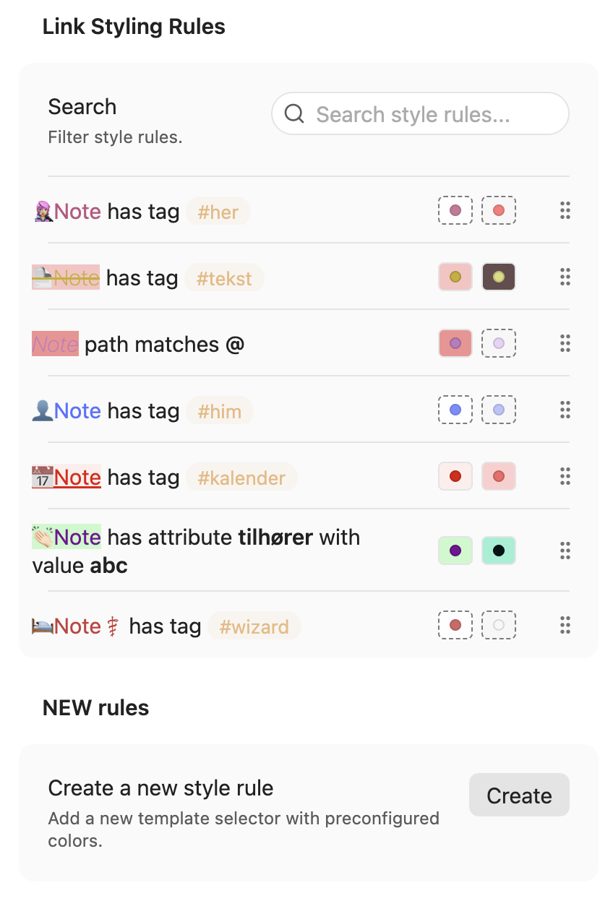
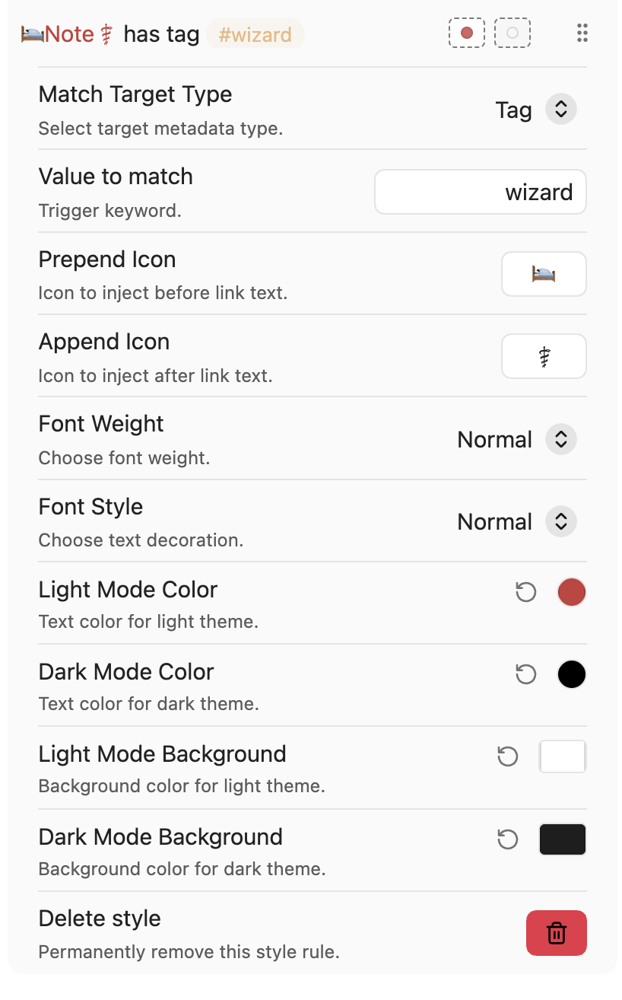

# Re-Supercharged Links

A modern, high-performance, and completely re-architected fork of **Supercharged Links** for Obsidian. Rebuilt from the ground up for instantaneous rendering, zero layout thrashing, and an ultra-light memory footprint.

---

## ✨ What this plugin does

**Re-Supercharged Links** turns metadata into visual context directly in your notes.

Instead of plain internal links, you can style links based on frontmatter/fields so they communicate status, type, priority, source, or category at a glance.

### Typical use cases

- Color links by `status` (e.g. active, waiting, done)
- Add subtle badges for `type` (project, meeting, person, reference)
- Highlight links by `priority`, `domain`, or `publishedIn`
- Keep visual consistency across large vaults without manual formatting

---
## ✨ The Architectural Evolution: Original vs. Re-Supercharged

To understand why **Re-Supercharged Links** was built, it helps to look at the mechanics under the hood. The original plugin was a trailblazer, but its underlying browser-handling methodologies created inherent scaling challenges in massive, multi-thousand-note vaults.

### 📊 Comparative Analysis

| Feature / Core Mechanism | Original Supercharged Links (`mdelobelle/..`) | Re-Supercharged Links (`CarlB01/..`) |
| :--- | :--- | :--- |
| **Styling Mechanism** | **Disk Persisted CSS Snippets.** Generates and writes a massive, static `.css` file (`re-supercharged-links-gen.css`) to your local drive every time a settings rule is touched. | **All-In-Memory Runtime.** Eliminates disk manipulation entirely. Styles are compiled and processed directly in-memory, updating UI profiles synchronously. |
| **DOM Engine Lookup** | **Substring Attribute Scanning ($=, \*=).** Forces the browser's graphics thread to perform deep, heavy sub-string match checks (e.g., `[data-link-tags*="👥gruppe" i]`) continuously on every frame while scrolling. | **O(1) Hash-Table Matching.** Assigns clean, static structural rules (`.scl-rule-${uid}`) during node assembly. The browser performs a point-blank lookup map query instantly. |
| **Icon Affixes (Emojis)** | **CSS Pseudo-Elements (`::before` / `::after`).** Emojis are injected blindly via text content properties in CSS style rules, creating standard timing lag anomalies. | **Physical HTML Widgets (``).** Embeds localized, lightweight spans natively inside CodeMirror 6 and Read Mode streams, giving the plugin total program control over the exact node lifecycle. |
| **Deduplication Handling** | **Prone to Visual Doubling.** If a filename naturally starts or ends with an emoji, the blind CSS selector injects a duplicate emoji anyway, cluttering link paths. | **Foolproof Early Suppression.** The TypeScript pipeline evaluates the raw label string *before* building nodes. If the emoji is already present in the filename text, node generation is cleanly bypassed. |

---

## ⚖️ The Honest Trade-offs: Pros and Cons

Engineering is about choices. While **Re-Supercharged Links** offers massive leaps forward in user experience and speed, it changes how the plugin interacts with the user's setup.

### 🟢 Pros (Why you should use it)
* **Zero UI Lag or Scrolling Micro-Stutter:** By dropping expensive string-matching CSS queries, large files maintain a fluid, locked 60+ FPS rhythm.
* **Instant Settings Feedback:** Color choices light up your links inside configuration preview badges in the exact microsecond you release the cursor from the color wheel.
* **No More Emoji Nightmares:** Edge-case composite Unicode duplication bugs (such as medical or group icons mirroring themselves onto links) are completely eliminated.
* **Cleaner Workspace Footprint:** No more ghost CSS snippet files lingering on your storage drive or crashing background file-watcher threads during rapid synchronization.

### 🔴 Cons (What to be aware of)
* **No Manual External CSS Tweaking:** Because styles are kept as active runtime states in memory instead of being exposed inside a global, readable `.css` file on your hard drive, you can't easily open an external text editor and manually hack the plugin's layout outputs with custom cascading user-snippets. (Custom rules must be built using the dedicated settings UI pane).
* **Deep Architectural Divergence:** This plugin has moved so far past the original implementation that settings objects are structurally unique. It cannot cleanly read or inherit old legacy data structures from the original plugin without re-configuring rules.

---

## ⚙️ Quick Start

1. Open **Settings → Community plugins** and install **Re-Supercharged Links**.
2. Navigate to the option pane and create a new selector rule targeting a metadata marker (e.g., `status`).
3. Assign text weight options, custom icon affixes, and distinct colors for both light and mørk mode.
4. Watch your workspace map itself out visually in real-time!

---

## 🖼️ Screenshots

Styles are created and edited directly in the settings UI.

---

## 🔌 Compatibility notes

- Built for Obsidian users who rely on metadata-heavy workflows
- Works especially well with structured vaults (projects, PARA, Zettelkasten hybrids)
- Bases and tag chip styling are implemented with scoped observers for safety/performance
- Dataview-related enrichment is handled defensively to avoid hard failures

---

## 🤝 Credits & Lineage

Deepest respect and gratitude to the original creators and maintainers of **Supercharged Links**. Their brilliant vision provided the conceptual baseline for what metadata links could achieve in Obsidian. This fork stands on that pioneering foundation, built to carry the workflow safely into future Obsidian API environments.

---

## 💚 Support

If this plugin improves your workflow:

- ⭐ Star the repo
- 🐞 Report issues / suggest improvements

---

Developed with care by a healthcare worker who relies on metadata-heavy vaults and loves colorful, meaningful links that tell a story at a glance.

License: **MIT**
