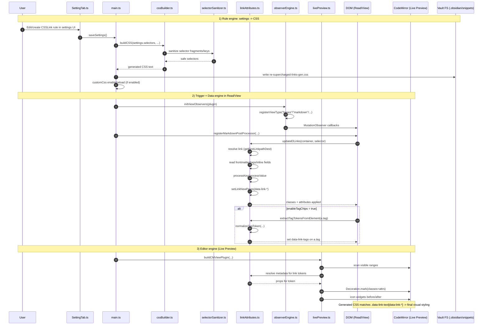

# Re-Supercharged Links – Architecture Note (v0.0.26)

Date: 2026-09-06  
Topic: Bases + tag chips + end-to-end flow (settings → CSS → attributes → render/editor)

---

## 1) Session summary

- Bases styling was stabilized by using:
  - `registerViewType("bases", ...)` as primary
  - markdown fallback for rendered base blocks when needed
- Tag chips (`a.tag`) gained support via a dedicated setting:
  - `enableTagChips` (separate from `enableBases`)
- Prepend/append icon dedupe added:
  - skip icon if the same token is already at the start/end of visible text
  - robust against emoji variation differences (`☠` vs `☠️` via normalization)

Result: fast scrolling, consistent styling, and less visual duplication.

---

## 2) High-level model: 3 engines

The plugin works as a pipeline with three engines:

1. **Rule engine**: settings → generated CSS  
2. **Data engine**: link-target metadata → `data-link-*` attributes  
3. **Trigger engine**: when/where updates run (read mode, views, editor)

When all three align, links get styled correctly.

---

## 3) Technical flow (with your function names)

### A) Rule engine (settings → CSS)
**Files**: `SettingTab.ts`, `cssBuilder.ts`, `selectorSanitizer.ts`, `main.ts`

- User creates/edits rules (`CSSLink`) in settings
- Changes are persisted via `saveSettings()`
- CSS snippet is regenerated via `buildCSS(...)`
- `buildCSS` creates:
  - per-rule UID variables in `.theme-light` / `.theme-dark`
  - selectors targeting `data-link-*` attributes
- Snippet is written to:
  - `.obsidian/snippets/re-supercharged-links-gen.css`
- If enabled: snippet activate/reload via `customCss`

👉 Defines **what should be styled**.

---

### B) Data engine (metadata → attributes)
**File**: `linkAttributes.ts`

When a link is processed:

- resolve target with `metadataCache.getFirstLinkpathDest(...)`
- read metadata:
  - frontmatter
  - tags (`getAllTags`) if enabled
  - optional inline fields (Dataview bridge)
- normalize keys via `processKey`
- build props object (`Record<string,string>`)
- set element attributes:
  - `data-link-tags="..."`
  - `data-link-path="..."`
  - `data-link-status="..."`
  - etc.
- add classes:
  - `data-link-text`

Also (new): when `enableTagChips` is true, process `a.tag` and set `data-link-tags`.

👉 Defines **which elements match which rules**.

---

### C) Trigger engine (when updates run)
**Files**: `main.ts`, `observerEngine.ts`, `livePreview.ts`

#### Read mode / rendered markdown
- `registerMarkdownPostProcessor(...)`
- runs `updateElLinks(...)` after render
- internal links receive `data-link-*`

#### Workspace/panels
- `updateVisibleLinks(...)` refreshes visible links across open leaves
- `initViewObservers(...)` + `registerViewType(...)` attach observers
- on DOM changes: `updateContainer(...)` runs

#### Edit mode (Live Preview / CodeMirror)
- `buildCMViewPlugin(...)` mounts CM plugin
- `livePreview.ts` scans visible ranges
- for link tokens:
  - resolve file
  - compute props
  - `Decoration.mark(...)` with attributes/classes
  - add before/after icon widgets

👉 Enables styling in both reading mode and editor mode.

---

## 4) Why styles actually apply

When an element has:

- class `.data-link-text`
- and matching `data-link-*` attributes

...the generated CSS selectors match and apply:

- `color`
- `background-color`
- `font-weight`
- `font-style`
- `text-decoration`
- `::before` / `::after` icon content

---

## 5) End-to-end example

Rule: `tag contains project-x`, bold, light color `#3366ff`.

1. Rule is saved in settings  
2. `buildCSS` generates selector:
   `.data-link-text[data-link-tags*="project-x" i] { ... }`
3. Link processing finds target has `#project-x`
4. Element gets `data-link-tags="... #project-x ..."`
5. CSS matches → link renders blue + bold

---

## 6) Sequence diagram (adapted to your function names)

---

## 7) Practical checklist

- Keep `enableBases` and `enableTagChips` separate
- Avoid duplicate tag-chip processing (one block only in `updateContainer`)
- Keep normalization/attribute logic centralized in `linkAttributes.ts`
- Let `main.ts` orchestrate rather than own parsing details
- For icon dedupe: compare against visible label before setting prepend/append

---